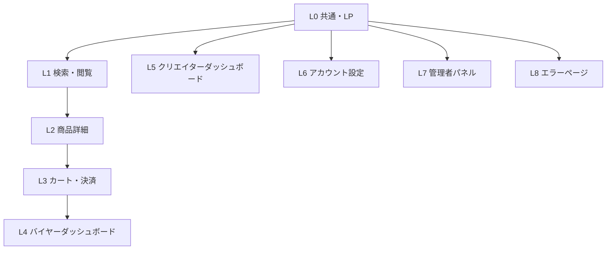

# AIアセットマーケットプレイス — 設計計画書

> **コンセプト**: AIテンプレート・デジタルアセット特化型マーケットプレイス  
> **参考デザイン**: Makuake（モダン・クリーン・日本語UI）  
> **スタック候補**: Next.js / Vite + React, Stripe決済, Cloudflare R2ストレージ

---

## 🎨 デザイン方針（Makuakeインスパイア）

Makuakeから取り込むUIパターン:
- **カード型商品表示** — 大きなサムネイル、クリエイター情報、進捗バッジを持つリッチカード
- **ヒーローバナースライダー** — フルワイドの特集・キャンペーン表示
- **カテゴリタブナビ** — ページ上部に固定されるゾーン切り替え
- **ランキング表示** — 順位バッジ付きの横スクロールまたはグリッド
- **グラスモーフィズムUI** — ダッシュボード系のカード、KPIウィジェット

独自の差別化点:
- AI/DX特化のカテゴリアイコン・タグ体系
- クリエイターダッシュボードの高機能化（アナリティクス、バージョン管理）
- プレビュー機能（Notion埋め込み、Figmaビューワー、コードシンタックスハイライト）

---

## 🗺 サイト全体マップ（8レイヤー構成）



---

## 📐 L0: トップページ（LP）— レイアウト詳細

```
┌──────────────────────────────────────────────────┐
│  HEADER（sticky）                                │
│  ロゴ | 検索バー(全幅) | カテゴリ▼ | 出品する |   │
│  🔔通知 | 🛒カート(n) | アカウント▼ / ログイン   │
└──────────────────────────────────────────────────┘

┌──────────────────────────────────────────────────┐
│  HERO（フルワイド、高さ500-600px）                │
│  ┌────────────────────┐  ┌──────────────────┐   │
│  │ キャッチコピー      │  │  背景: グラデ+   │   │
│  │ サブコピー          │  │  アニメーション  │   │
│  │ [🔍 検索バー]       │  │  粒子エフェクト  │   │
│  │ [アセットを探す]    │  │                  │   │
│  │ [出品する →]        │  └──────────────────┘   │
│  └────────────────────┘                          │
└──────────────────────────────────────────────────┘

┌──────────────────────────────────────────────────┐
│  カテゴリナビ（タブ + アイコングリッド）          │
│  [業務DX] [デザイン] [コンポーネント] [教育]      │
│  ──────────────────────────────────────          │
│  [Notion] [Figma] [n8n] [Excel] [AI] [Canva]... │
└──────────────────────────────────────────────────┘

┌──────────────────────────────────────────────────┐
│  🔥 トレンドアセット（週間ランキング）            │
│  タイトル + [もっと見る →]                       │
│  ┌──────┐ ┌──────┐ ┌──────┐ ┌──────┐           │
│  │  #1  │ │  #2  │ │  #3  │ │  #4  │ ...        │
│  │サムネ│ │サムネ│ │サムネ│ │サムネ│            │
│  │タイトル 価格 ⭐評価                           │
│  └──────┘ └──────┘ └──────┘ └──────┘            │
└──────────────────────────────────────────────────┘

┌──────────────────────────────────────────────────┐
│  ⭐ スタッフおすすめ / 特集バナー                │
│  ┌─────────────────────────┐ ┌─────────────┐    │
│  │ 🎯 今月の営業DX特集      │ │ 新着注目    │    │
│  │ バナー画像 + CTA        │ │ アセット    │    │
│  └─────────────────────────┘ └─────────────┘    │
└──────────────────────────────────────────────────┘

┌──────────────────────────────────────────────────┐
│  🏆 トップクリエイター（水平スクロール）          │
│  ┌─────┐ ┌─────┐ ┌─────┐ ┌─────┐               │
│  │アバタ│ │アバタ│ │アバタ│ │アバタ│             │
│  │名前  │ │名前  │ │名前  │ │名前  │             │
│  │売上数│ │売上数│ │売上数│ │売上数│             │
│  └─────┘ └─────┘ └─────┘ └─────┘               │
└──────────────────────────────────────────────────┘

┌──────────────────────────────────────────────────┐
│  📊 プラットフォーム実績                         │
│  [ 12,450 ]  [ 89,200 ]  [ 3,210 ]              │
│  総出品数    総DL数      登録クリエイター         │
│  （アニメーションカウンター）                    │
└──────────────────────────────────────────────────┘

┌──────────────────────────────────────────────────┐
│  💡 サービス紹介（2カラム：買い手 / 売り手）      │
│  ┌──────────────────┐ ┌──────────────────┐       │
│  │ 🛒 買い手向け     │ │ 🎨 売り手向け    │       │
│  │ メリット3点       │ │ メリット3点      │       │
│  └──────────────────┘ └──────────────────┘       │
│  ────────────────────────────────────────         │
│  利用フロー：[① 探す] → [② 購入] → [③ 活用]     │
└──────────────────────────────────────────────────┘

┌──────────────────────────────────────────────────┐
│  CTA：新規登録 / ログイン（フルワイド）           │
│  「今すぐ始める」 「クリエイターとして出品」       │
└──────────────────────────────────────────────────┘

┌──────────────────────────────────────────────────┐
│  FOOTER（4カラム）                               │
│  カテゴリ | サービス情報 | サポート | SNS・言語   │
└──────────────────────────────────────────────────┘
```

---

## 📐 L1: 商品一覧ページ — レイアウト

```
┌──────────────────────────────────────────────────┐
│ パンくず: トップ > 業務DX > Notionテンプレート   │
│ 「Notionテンプレート」(件数: 1,234件)             │
├─────────────┬────────────────────────────────────┤
│ フィルター  │ [おすすめ▼] [グリッド|リスト] [件数]│
│ サイドバー  ├────────────────────────────────────┤
│             │ ┌──────┐ ┌──────┐ ┌──────┐         │
│ □カテゴリ   │ │ 🖼️  │ │ 🖼️  │ │ 🖼️  │        │
│ □ツール     │ │タイトル タイトル タイトル         │
│ 価格帯      │ │クリエ  クリエ   クリエ           │
│ [——●——]    │ │⭐4.8  ⭐4.5   ⭐4.7             │
│ □無料のみ   │ │¥2,980 ¥4,800  FREE               │
│ □ファイル形式│ │♡      ♡       ♡                │
│ □ライセンス │ └──────┘ └──────┘ └──────┘         │
│ □評価       │  ... (無限スクロール / ページング)  │
│ □言語       │                                    │
│ □タグ       │                                    │
└─────────────┴────────────────────────────────────┘
```

---

## 📐 L2: 商品詳細ページ — レイアウト

```
┌──────────────────────────────────────────────────┐
│ パンくず                                         │
├─────────────────────────────┬────────────────────┤
│ 📸 メディアセクション（左）  │ 💰 購入パネル（右）│
│                             │                    │
│ ┌─────────────────────────┐ │ タイトル           │
│ │                         │ │ クリエイター情報   │
│ │      メイン画像         │ │ ⭐ 4.8 (234件)     │
│ │  （スライダー）         │ │                    │
│ │                         │ │ ライセンス選択     │
│ └─────────────────────────┘ │ ○個人 ¥2,980      │
│ [🖼][🖼][🎬][🖼][🖼]        │ ○商用 ¥5,980      │
│                             │ ○チーム ¥14,800   │
│ カテゴリ別プレビュー:       │                    │
│ Notion埋め込み/             │ [🛒 カートに追加]  │
│ Figmaビューワー/            │ [⚡ 今すぐ購入]    │
│ コードハイライト/           │ [♡ お気に入り]    │
│ 音声試聴/動画プレビュー     │ [🔗 シェア]       │
│                             │                    │
│                             │ DL数: 1,234        │
│                             │ 更新: v2.1         │
│                             │ 最終更新: 2025/06  │
└─────────────────────────────┴────────────────────┘

┌──────────────────────────────────────────────────┐
│ [概要] [セットアップ] [必須要件] [ファイル] [更新履歴] [ライセンス] │
│ ─────────────────────────────────────────────    │
│ 商品説明コンテンツ（タブ切り替え）               │
└──────────────────────────────────────────────────┘

┌──────────────────────────────────────────────────┐
│ 💬 Q&A | ⭐ レビュー | 🔗 関連商品 | 📦 バンドル │
└──────────────────────────────────────────────────┘
```

---

## 📐 L5: クリエイターダッシュボード — レイアウト

```
┌──────────────────────────────────────────────────┐
│ [バイヤー画面へ切り替え]                         │
├──────────┬───────────────────────────────────────┤
│ サイドバー│ ダッシュボードホーム                 │
│          │                                       │
│ 📊 概要  │ ┌──────┐┌──────┐┌──────┐┌──────┐    │
│ 📦 出品  │ │今月売上││販売数││残高  ││平均⭐│    │
│ 📝 新規  │ │¥128K ││ 42件 ││¥96K ││4.82 │    │
│ 🔄 更新  │ └──────┘└──────┘└──────┘└──────┘    │
│ 📊 分析  │                                       │
│ 💰 収益  │ 📈 売上推移グラフ（折れ線+棒）         │
│ 💬 Q&A  │ ─────────────────────────────         │
│ ⭐ レビュ│ 🔥 最近の売上トランザクション（10件）  │
│ 📦 バンドル│ ─────────────────────────────       │
│          │ 📦 人気アセットTOP5                   │
└──────────┴───────────────────────────────────────┘
```

---

## 🏗 カテゴリ分類（4ゾーン / 14カテゴリ）

| ゾーン | カテゴリ | 代表ツール |
|--------|---------|-----------|
| 🔷 業務DX | ① Notionテンプレート | Notion |
| 🔷 業務DX | ② ノーコードワークフロー | n8n, Make, Zapier |
| 🔷 業務DX | ③ スプレッドシート | Google Sheets, Excel |
| 🔷 業務DX | ④ AIプロンプト・設定 | ChatGPT, Claude, Midjourney |
| 🔶 デザイン | ⑤ UIデザインアセット | Figma, XD |
| 🔶 デザイン | ⑥ グラフィック素材 | Canva, Illustrator |
| 🔶 デザイン | ⑦ 写真・画像素材 | - |
| 🔶 デザイン | ⑧ フォント | WOFF2, TTF |
| 🔶 デザイン | ⑨ 動画・モーション | After Effects, Premiere |
| 🔶 デザイン | ⑩ 音声・BGM | ロイヤリティフリー |
| 🔶 デザイン | ⑪ 3Dモデル | Blender, Unity, Unreal |
| 🔵 コンポーネント | ⑫ UIコンポーネント | React, Vue, Tailwind |
| 🔵 コンポーネント | ⑬ コードスニペット | Python, GAS, VBA |
| 🟢 教育 | ⑭ オンライン講座 | 動画・ハンズオン |

### コード出品判定基準
```
Q1: 単独デプロイ可能？ → YES = ❌出品不可（完成品）
                        → NO  = Q2へ
Q2: 他プロジェクトに組み込む「部品」？ → YES = ✅出品OK
                                       → NO  = Q3へ
Q3: 特定機能に限定？ → YES = ✅出品OK / NO = ❌出品不可
```

---

## 🖥 主要UIコンポーネント一覧

### 共通コンポーネント
| コンポーネント | 説明 |
|--------------|------|
| `<Header>` | sticky、検索バー、カテゴリドロップダウン、カートバッジ |
| `<Footer>` | 4カラム、言語切り替え |
| `<AssetCard>` | サムネイル、クリエイター、評価、価格、バッジ、♡ボタン |
| `<CategoryNav>` | ゾーンタブ + ツールアイコングリッド |
| `<SearchBar>` | オートコンプリート、フィルタークイックアクセス |
| `<FilterSidebar>` | チェックボックス、スライダー、タグ、コラプス |
| `<SortDropdown>` | おすすめ/人気/新着/価格/評価 |
| `<MediaSlider>` | 画像・動画・スペシャルプレビュー |
| `<PricePanel>` | ライセンス選択、カート/購入ボタン |
| `<ReviewSummary>` | 星分布バー、項目別評価 |
| `<KPICard>` | グラスモーフィズム、数値+前月比 |
| `<SalesChart>` | 折れ線+棒グラフ（期間切り替え）|
| `<ProgressWizard>` | 出品ウィザード、ステップ管理 |
| `<StatusBadge>` | 公開中/審査中/下書き/非公開/却下 |

---

## 🚀 フェーズ別ロールアウト計画

| フェーズ | 期間 | 主要機能 |
|---------|------|---------|
| **Phase 1** MVP | Month 1-2 | Notionテンプレート、スプレッドシート、AIプロンプト、Stripe決済、レビュー、クリエイターダッシュボード基本版 |
| **Phase 2** DX拡張 | Month 3-4 | ノーコードワークフロー、UIコンポーネント、コードスニペット、バージョン管理、バンドル販売 |
| **Phase 3** クリエイティブ | Month 5-6 | Figma/UIデザイン、Canva、グラフィック、フォント、多段階ライセンス、3Dビューワー |
| **Phase 4** メディア&教育 | Month 7-8 | 動画テンプレート、音声/BGM、オンライン講座、試聴プレーヤー |
| **Phase 5** 成熟 | Month 9-12 | サブスク、アフィリエイト、AIレコメンデーション、多言語、クリエイター認定制度 |

---

## 📝 技術スタック（推奨）

```
フロントエンド:  Next.js 14+ (App Router) または Vite + React
スタイリング:    Tailwind CSS + shadcn/ui
決済:           Stripe (Checkout + Connect)
ストレージ:      Cloudflare R2 (ファイル) + Cloudflare Images (画像)
DB:             PostgreSQL (Supabase / PlanetScale)
認証:           NextAuth.js / Supabase Auth (Google OAuth)
メール:         Resend / SendGrid
グラフ:         Recharts / Chart.js
リッチテキスト:  TipTap / Quill
3Dビューワー:    Three.js / React Three Fiber
Notionプレビュー: Notion API 公開ページ埋め込み
```

---

## ⚠️ 設計上の注意点

> [!IMPORTANT]
> **「完成品禁止」ポリシー**: コード系アセットは「部品・モジュール」のみ許可。WordPressテーマ、Next.jsフルアプリ等の完成品は出品不可。審査フローで厳格に判定。

> [!NOTE]
> **プレビュー機能の実装難易度**: カテゴリごとに全く異なるプレビュー方法が必要（Notion埋め込み、Figmaビューワー、音声試聴、3D回転ビューワー等）。Phase 1では画像・動画のみに限定し、徐々に追加するのが現実的。

> [!TIP]
> **クリエイターダッシュボードの切り替えUI**: バイヤー/クリエイター画面の切り替えボタンは「常時画面上部に表示」。どちら側のダッシュボードにいても迷わないUXを設計。

> [!WARNING]
> **Stripe Connect**: クリエイターへの収益送金にはStripe Connectの設定が必要。日本の銀行振込との連携、インボイス制度対応、源泉徴収対応を考慮すること。
